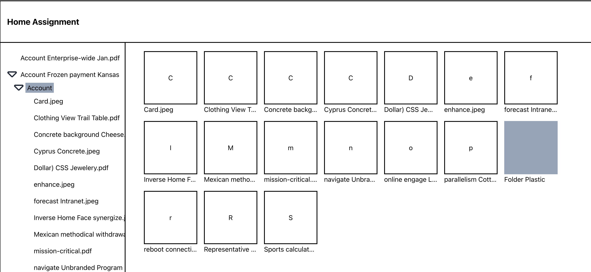

A React feature-based organization project to ensure a maintanable structure that displays a file system directory

Below is an explanation of the packages used, as well as the steps taken to resolve each user story.

- <strong> Tailwind </strong> While not necessary for this project, Tailwind CSS simplifies styling by removing repetitive custom CSS. It has become a go to for my projects.
- <strong> swr </strong> Simplify data fetching.
- <strong> clsx </strong>  Makes conditional in classNames easier to read for 

## Steps
#### User story 1: View Tree
- Created a `Sidebar` with all necessary styling
- Developed a Tree component to fetch, sort, and render directory data using SWR, displaying folders and files in order

#### User story 2: Expand/Collapse Tree Nodes
- Built a TreeNode component with local state using `useState()` hook to manage node expansion, keeping the state local to each node

#### User story 3: Activating a File/Folder in Sidebar

- Create a context `TreeContext` to enables communication between components or in this case, Tree components: `TreeNode` and  `TreeNodeDetails`content..
- Created a  `TreeNodeDetails` component to display the selected node(active), listening for changes via TreeContext
- Updated `TreeNode`  component to set the selected node in the `TreeContext` when clicked

#### User story 4: Activating a File/Folder in Main Area
- Added a new state in `TreeContext` to track  `expandedNodeIds`
- Implemented `TreeContext > expandNodeAndParents`  to expand all parent nodes when selecting a node, to ensure its path is visible in the sidebar
- Updated `TreeNodeDetails` to update a selected node state `TreeContext > selectedNodeId` when clicked

***

